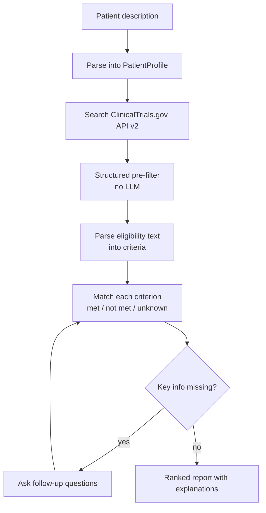
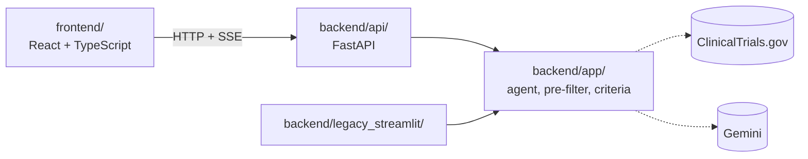

# ProtocolLens

ProtocolLens helps patients and study teams find clinical trials that may fit, and explains why. Given a plain-language patient description, it searches ClinicalTrials.gov, filters candidates on structured fields, and then judges each eligibility criterion as **met**, **not met**, or **unknown**, citing the source text.

It is a full-stack web app: a FastAPI backend running an LLM agent, and a React + TypeScript frontend that streams the agent's progress live.

<!-- Add once deployed: **Live demo:** https://... -->

> **Status:** Trial matching is under active development. The original protocol PDF analysis and role-based Q&A work today in the legacy Streamlit app. See the [roadmap](#roadmap).

> **Disclaimer:** ProtocolLens is a research and portfolio project. It is not medical advice and does not determine eligibility. Results are framed as "potentially eligible"; the final decision always belongs to the study site.

## Why this project

Eligibility criteria on ClinicalTrials.gov are a single block of free text. Headers vary ("Inclusion Criteria" vs. "Key Inclusion Criteria"), bullets are inconsistent, and sub-items are flattened. Keyword search cannot tell a patient whether they qualify.

ProtocolLens treats this as two separate problems:

1. **Everything structured stays in code.** Condition, location, recruiting status, phase, age, and sex come straight from the API and are filtered without an LLM.
2. **The LLM is used only where it is needed.** It parses the free-text criteria and judges them one by one against the patient profile, so every conclusion can be traced to a specific criterion.

## Features

| Feature | Status |
| --- | --- |
| Protocol PDF analysis: structured trial object from an uploaded protocol (legacy Streamlit app) | Available |
| Role-based Q&A about a trial from a patient, coordinator, or sponsor perspective | Available in the legacy app; moving to the API |
| Trial search via ClinicalTrials.gov API v2 with location and status filters | In progress |
| Structured pre-filter (age, sex, study type, per-site recruiting status) | In progress |
| Per-criterion matching with met / not met / unknown and reasons | In progress |
| FastAPI backend with a streamed agent progress feed | In progress |
| React frontend: matching page, trial detail, criterion table | In progress |
| Follow-up questions when patient information is missing | Planned |
| Deterministic clinical calculators (eGFR, CrCl, BMI, unit conversion) | Planned |
| Audit trail of every agent decision | Planned |

## How it works



1. **Parse the patient description** into a `PatientProfile`. Missing fields stay empty; nothing is guessed.
2. **Search** the API by condition, keywords, recruiting status, and distance.
3. **Pre-filter** on structured fields. This step also checks that a nearby site is recruiting, not just the trial overall.
4. **Parse eligibility** text into individual `Criterion` objects, cached per trial.
5. **Match** each criterion against the patient. Anything not explicitly stated in the profile is `unknown`.
6. **Rank and report** each trial with its verdict, per-criterion reasoning, nearest site, and contact.

## Architecture



- **`frontend/`** never calls Gemini or ClinicalTrials.gov directly, so API keys stay on the server.
- **`backend/api/`** is a thin layer: validation, sessions, and the event stream.
- **`backend/app/`** holds all matching logic and imports no web framework, so it is tested on its own.

The agent takes many seconds per request, so the backend streams progress ("Searching", "Filtering 42 trials", "Matching criteria") and each trial result over server-sent events as it finishes.

```
backend/
  app/                # core: schemas, matching, prompts, Gemini client
  api/                # FastAPI routes, sessions, SSE
  legacy_streamlit/   # original PDF analysis UI
  tests/
  evals/
frontend/
  src/                # pages, components, hooks, generated API types
docs/design.md        # full design doc
```

See [docs/design.md](docs/design.md) for the API routes, event types, and design decisions.

## Tech stack

| Layer | Tools |
| --- | --- |
| Backend | Python, FastAPI, Pydantic |
| LLM | Google Gemini API: Flash for parsing and matching, Pro for report synthesis |
| Data | ClinicalTrials.gov API v2 (no API key required) |
| Frontend | React, TypeScript, Vite, Tailwind, shadcn/ui, TanStack Query |
| Contract | TypeScript types generated from the OpenAPI schema |
| Tests | pytest; Vitest + React Testing Library |
| CI | GitHub Actions |

## Getting started

**Backend**

```bash
cd backend
python -m venv .venv
source .venv/bin/activate        # Windows: .venv\Scripts\activate
pip install -r requirements.txt
```

Create `backend/.env`:

```
GEMINI_API_KEY=your_key_here
FRONTEND_ORIGIN=http://localhost:5173
```

```bash
uvicorn api.main:app --reload    # http://localhost:8000, API docs at /docs
```

**Frontend**

```bash
cd frontend
npm install
npm run dev                      # http://localhost:5173
```

Create `frontend/.env`:

```
VITE_API_URL=http://localhost:8000
```

**Legacy PDF analysis app**

```bash
cd backend
streamlit run legacy_streamlit/main.py
```

**Tests**

```bash
cd backend && pytest
cd frontend && npm test
```

## Data and privacy

- All patient examples in this repository are **synthetic**. Do not enter real patient information.
- ProtocolLens is not HIPAA-compliant and is not designed to handle PHI. Sessions are held in memory and expire; no patient text is written to disk.
- Trial data comes from the public ClinicalTrials.gov registry. Registry entries summarize a protocol and can omit details; criteria marked "as defined per protocol" must be confirmed with the study site.

## Roadmap

| Phase | Target | Scope | Status |
| --- | --- | --- | --- |
| P1 Full-stack minimal loop | Mid-Nov 2026 | Core matching, FastAPI with streamed progress, React UI, deployed demo | In progress |
| P2 Evaluation | Jan 2027 | Labeled parsing set, TREC evaluation, keyword-search baseline | Planned |
| P3 Agent upgrade | Mar 2027 (est.) | RxNorm and calculators, follow-up questions, LangGraph | Planned |
| P4 MCP and audit trail | From Apr 2027 (est.) | MCP server, audit trail view, ICH/FDA resources | Planned |

Tasks are tracked in [GitHub milestones](../../milestones). Exit criteria and the reasoning behind the order are in [docs/design.md](docs/design.md#roadmap).

## Background

ProtocolLens started as a Gemini API hackathon project for protocol PDF analysis. It is built by a bioanalytical scientist with over ten years in GxP-regulated drug development, which shapes two design choices: conclusions must be traceable to source text, and the system must say "unknown" when the evidence is not there.

## License

<!-- Add a license, e.g. MIT -->
