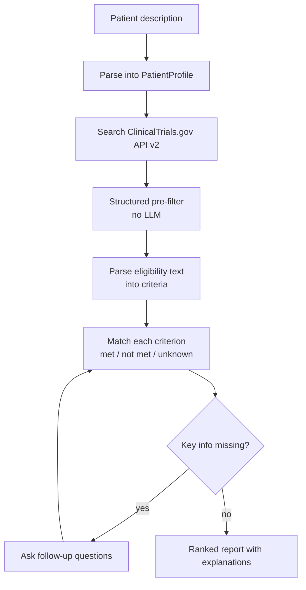

# ProtocolLens

ProtocolLens helps patients and study teams find clinical trials that may fit, and explains why. Given a plain-language patient description, it searches ClinicalTrials.gov, filters candidates on structured fields, and then judges each eligibility criterion as **met**, **not met**, or **unknown**, citing the source text.

It also analyzes full protocol PDFs and answers role-specific questions about any trial.

> **Status:** The PDF analysis and role-based Q&A work today. Trial matching is under active development. See the [roadmap](#roadmap).

> **Disclaimer:** ProtocolLens is a research and portfolio project. It is not medical advice and does not determine eligibility. Results are framed as "potentially eligible"; the final decision always belongs to the study site.

## Why this project

Eligibility criteria on ClinicalTrials.gov are a single block of free text. Headers vary ("Inclusion Criteria" vs. "Key Inclusion Criteria"), bullets are inconsistent, and sub-items are flattened. Keyword search cannot tell a patient whether they qualify.

ProtocolLens treats this as two separate problems:

1. **Everything structured stays in code.** Condition, location, recruiting status, phase, age, and sex come straight from the API and are filtered without an LLM.
2. **The LLM is used only where it is needed.** It parses the free-text criteria and judges them one by one against the patient profile, so every conclusion can be traced to a specific criterion.

## Features

| Feature | Status |
| --- | --- |
| Protocol PDF analysis: extract a structured trial object from an uploaded protocol | Available |
| Role-based Q&A: ask questions about a trial from a patient, coordinator, or sponsor perspective | Available |
| Trial search via ClinicalTrials.gov API v2 with location and status filters | In progress |
| Structured pre-filter (age, sex, study type, per-site recruiting status) | In progress |
| Per-criterion matching with met / not met / unknown and reasons | In progress |
| Follow-up questions when patient information is missing | Planned |
| Deterministic clinical calculators (eGFR, CrCl, BMI, unit conversion) | Planned |
| Audit trail of every agent decision | Planned |

## How it works



1. **Parse the patient description** into a `PatientProfile`. Missing fields stay empty; nothing is guessed.
2. **Search** the API by condition, keywords, recruiting status, and distance.
3. **Pre-filter** on structured fields. This step also checks that a nearby site is recruiting, not just the trial overall.
4. **Parse eligibility** text into individual `Criterion` objects, cached per trial.
5. **Match** each criterion against the patient. Anything not explicitly stated in the profile is `unknown`.
6. **Rank and report** each trial with its verdict, per-criterion reasoning, nearest site, and contact.

## Architecture

Two entry points share one core:

```
Trial matching (new)            PDF analysis (existing)
        |                               |
  app/matching/                 pdf_parser, orchestrator
        |                               |
        +-------------+-----------------+
                      |
               Shared core
   TrialObject schema · GeminiClient · role-based Q&A
```

```
app/
  schemas/        # TrialObject, Criterion, PatientProfile
  utils/          # Gemini clients, PDF parser
  matching/       # API client, mapper, pre-filter, criteria, agent
  prompts/        # Prompt templates
  orchestrator.py # PDF entry point
samples/          # Saved API responses, used as test fixtures
evals/            # Labeled data and evaluation scripts
tests/
docs/design.md    # Design doc
```

## Tech stack

- Python, Pydantic
- Google Gemini API (`google-genai`), Flash for parsing and matching, Pro for report synthesis
- ClinicalTrials.gov API v2 (no API key required)
- Streamlit UI
- pdfplumber for the PDF entry point

## Getting started

```bash
git clone <your-repo-url>
cd protocollens
python -m venv .venv
source .venv/bin/activate
pip install -r requirements.txt
```

Create a `.env` file in the project root:

```
GEMINI_API_KEY=your_key_here
```

Run the app:

```bash
streamlit run app.py
```

## Data and privacy

- All patient examples in this repository are **synthetic**. Do not enter real patient information.
- ProtocolLens is not HIPAA-compliant and is not designed to handle PHI.
- Trial data comes from the public ClinicalTrials.gov registry. Registry entries summarize a protocol and can omit details; criteria marked "as defined per protocol" must be confirmed with the study site.

## Roadmap

Timeline assumes part-time development. P3 and P4 dates are estimates.

### P1: Minimal matching loop (Oct 2026)

Exit criteria: a patient description returns nearby recruiting trials with per-criterion explanations, demo-ready.

- [ ] ClinicalTrials.gov API client with search, fetch by ID, and local cache
- [ ] Mapper from API JSON to `TrialObject`
- [ ] `PatientProfile` schema and patient-description parsing
- [ ] Structured pre-filter
- [ ] Criteria parsing with caching
- [ ] Per-criterion matching
- [ ] Agent loop on Gemini function calling
- [ ] Matching page in the Streamlit UI

### P2: Evaluation (Nov to Dec 2026)

Exit criteria: this README reports measured results against a baseline.

- [ ] Hand-labeled set for criteria parsing (precision / recall)
- [ ] Trial-level evaluation on TREC Clinical Trials Track data (NDCG@10, Precision@10)
- [ ] Keyword-search baseline for comparison

### P3: Agent upgrade (Jan to Feb 2027, estimated)

Exit criteria: follow-up questions work end to end; ablation results published.

- [ ] RxNorm drug-class lookup and deterministic calculators
- [ ] Follow-up questions for missing patient information
- [ ] LangGraph orchestration
- [ ] Per-tool ablation study

### P4: MCP and audit trail (from Mar 2027, estimated)

Exit criteria: external MCP clients can call the tools; every agent decision is traceable.

- [ ] ProtocolLens MCP server (FastMCP)
- [ ] GxP-style audit trail of agent decisions
- [ ] ICH/FDA guidance documents as MCP resources

## Background

ProtocolLens started as a Gemini API hackathon project for protocol PDF analysis. It is built by a bioanalytical scientist with over ten years in GxP-regulated drug development, which shapes two design choices: conclusions must be traceable to source text, and the system must say "unknown" when the evidence is not there.

## License

<!-- Add a license, e.g. MIT -->
