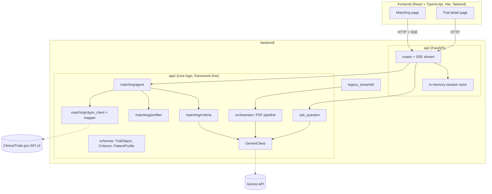

# ProtocolLens Trial Matching: Design Doc

Last updated: 2026-10-05 (revised for the FastAPI + React stack)

## Summary

ProtocolLens adds an agentic trial matching feature: given a patient description, it finds candidate trials from the ClinicalTrials.gov API v2 and explains, criterion by criterion, why each trial does or does not fit.

It ships as a full-stack web app. A FastAPI backend exposes the matching agent over a typed HTTP API, and a React + TypeScript frontend streams the agent's progress and presents the per-criterion results.

The data source moves from uploaded PDFs to direct API calls. Most ClinicalTrials.gov fields are already structured; only `eligibilityCriteria` is free text. The LLM is therefore used on that field alone, which cuts per-trial input from a full PDF to a few hundred to two thousand tokens.

The existing Streamlit app for PDF analysis stays as a legacy UI. Role-based Q&A is reused and also exposed through the new API. Everything shares one `TrialObject` schema and one Gemini client.

## Goals and non-goals

**Goals**

- Take a free-text patient description (condition, age, sex, location, prior treatment) and return recruiting trials ranked by fit.
- For each trial, judge every eligibility criterion as met, not met, or unknown, and cite the source text.
- When information is missing, the agent asks the patient for the key missing facts.
- Record every search and judgment in a traceable, GxP-style audit trail.
- Provide quantitative evaluation against a keyword-search baseline on a public dataset.
- Deliver it as a deployed full-stack app: typed API contract, streamed agent progress, tests on both sides, CI on every PR.

**Non-goals**

- No real patient data. Synthetic patients only, with the PHI/HIPAA boundary stated in the README.
- No medical advice or enrollment decisions. Output is always framed as "potentially eligible"; the final call belongs to the study site.
- No full-protocol parsing. Schedule of Activities and statistical analysis plans are not in the API data and stay with the legacy PDF app.
- No user accounts, login, or stored patient records. Sessions live in memory and expire.
- No port of the PDF analysis UI to React in the first phases. The Streamlit version keeps working as is.
- No LangGraph or MCP in the first phase. Gemini function calling comes first.

## Users and use cases

The primary use case is a patient or family member looking for a trial.

| Role | What they want | Where |
| --- | --- | --- |
| Patient / family | Describe the condition and location, find nearby recruiting trials that may fit, and understand why each fits or not | Web app: matching page |
| Study coordinator / physician | Pre-screen a patient quickly, focusing on exclusion criteria and items that need follow-up | Web app: matching page |
| Any role | Ask role-specific questions about one trial | Web app: trial detail page |
| Sponsor / researcher | Upload a full protocol PDF for structured analysis | Legacy Streamlit app |

Example input: "62-year-old woman, HR+/HER2- metastatic breast cancer, progressed after a CDK4/6 inhibitor, lives in Chicago, willing to travel up to 50 miles."

## Architecture



There are three layers, and dependencies point one way only:

1. **`frontend/`** talks to the backend over HTTP and server-sent events. It never calls Gemini or ClinicalTrials.gov directly, so API keys stay on the server.
2. **`backend/api/`** is a thin FastAPI layer: request validation, session handling, streaming. It contains no matching logic.
3. **`backend/app/`** is the core. Nothing in it imports FastAPI or Streamlit; functions take and return plain strings, dicts, and Pydantic models. This keeps it testable on its own and reusable behind the MCP server planned for P4.

The legacy Streamlit app imports the same core. Known exception to the layering rule: `gemini_client_with_pdf.py` accepts a Streamlit `UploadedFile`. It is left as is and not extended.

**Stack**

| Layer | Choice | Reason |
| --- | --- | --- |
| Backend | FastAPI + Pydantic | Existing Pydantic models become request and response schemas; OpenAPI docs are generated |
| Frontend | React + TypeScript, built with Vite | Standard SPA setup; no server-side rendering needed with a separate backend |
| Styling | Tailwind + shadcn/ui | Utility styling plus ready-made tables, forms, and dialogs |
| Data fetching | TanStack Query | Loading, error, and cache states |
| Contract | `openapi-typescript` | TypeScript types generated from the backend's OpenAPI schema |
| Tests | pytest; Vitest + React Testing Library | Both sides covered |
| CI | GitHub Actions | Lint, type-check, and test on every PR |
| Deploy | Backend on Render or Cloud Run; frontend on Vercel | Free tiers and a public demo URL |

## Data source and data model

The only data source is the ClinicalTrials.gov API v2 (`/api/v2/studies`), which needs no API key. Searches use the `fields` parameter to request only the modules below, avoiding thousands of lines of site lists and results data.

| TrialObject field | API module | LLM needed |
| --- | --- | --- |
| trial_metadata | identificationModule, statusModule | No |
| study_design | designModule (studyType, phases, designInfo) | No |
| conditions | conditionsModule + derivedSection.conditionBrowseModule (MeSH) | No |
| interventions | armsInterventionsModule + interventionBrowseModule | No |
| endpoints | outcomesModule | No |
| study_timeline | Dates in statusModule | No |
| sponsors_locations | sponsorCollaboratorsModule, contactsLocationsModule (per-site status and geoPoint) | No |
| eligibility (hard constraints) | eligibilityModule: sex, minimumAge, maximumAge, healthyVolunteers | No |
| eligibility (individual criteria) | eligibilityModule.eligibilityCriteria (free text) | Yes |
| safety | No direct match; trials with results have resultsSection.adverseEventsModule | No (optional) |

**Schema changes**

- Make every module Optional. Observational studies have no phases, and many trials lack maximumAge or ipdSharingStatementModule.
- Add `source: Literal["ctgov_api", "pdf"]` to record where a trial came from.
- Add a `Criterion` model: `text` (verbatim), `type` (inclusion / exclusion), `category` (demographics, diagnosis, prior therapy, labs, comorbidities, etc.), `group` (parent item, for flattened sub-items), `needs_protocol_reference` (true when the text says "as defined per protocol" or similar).
- Add a `PatientProfile` model: age, sex, diagnosis, stage, biomarkers, prior therapies, lab values, location, travel radius. All fields Optional.

**Text problems seen in real samples**

- Headers vary: "Inclusion Criteria:" in some trials, "Key Inclusion Criteria:" in others.
- Bullets are inconsistent: `*` and `-` mixed in one block, plus items with no bullet at all.
- Hierarchy is flattened: the sub-items of "Adequate organ function:" appear as its siblings.
- Markdown escapes (`\>`, `\<`, `\[`) are present and get stripped before the text reaches the LLM.

## Matching pipeline

The principle: filter cheaply on structured fields first, and call the LLM only on the few candidates that remain.

1. **Parse the patient description.** The LLM turns free text into a `PatientProfile`. Missing fields stay empty; nothing is guessed.
2. **Search.** Call the API with `query.cond`, `query.term`, `filter.overallStatus=RECRUITING` and `filter.geo=distance(lat,lon,radius)`. The agent picks search terms and synonyms (for example "NSCLC" and "non-small cell lung cancer").
3. **Structured pre-filter** (plain code, no LLM):
   - Drop trials that fail on age, sex, or healthyVolunteers
   - Filter by studyType and phases (for example, the patient wants interventional trials only)
   - Check that at least one site within range has its own status set to RECRUITING, not just the trial overall
4. **Parse eligibility.** A regex first splits the text on `(Key )?Exclusion Criteria:?`; the Flash model then turns each half into a list of `Criterion` objects. If no header is found, the whole text goes to the LLM. Results are cached by NCT ID and `lastUpdatePostDate`, so a trial is never parsed twice.
5. **Match criterion by criterion.** For each criterion the LLM returns `met` / `not_met` / `unknown` with a one-sentence reason and the patient fact it relied on. Items that need arithmetic (eGFR, BMI, unit conversion) call deterministic tools instead of letting the LLM compute.
6. **Rank and report.** A trial is marked not eligible if any exclusion criterion is `met` or any inclusion criterion is `not_met`. The rest are ranked by share of `met` criteria and number of `unknown` ones. The report lists each trial's verdict, per-criterion judgments, nearest site, and contact.
7. **Follow up.** The most frequent `unknown` items are merged into at most 3 questions for the patient. After the answers arrive, only steps 5 and 6 rerun.

**Model split:** parsing and per-criterion matching use `Config.FLASH_MODEL`; only the final report synthesis uses `Config.PRO_MODEL`. Structured output uses Gemini's `response_schema`, replacing the current manual stripping of JSON code fences.

## Agent design

Version one is a single-agent loop on Gemini native function calling. LangGraph and MCP come in later phases behind the same tool interfaces.

| Tool | Input | Output | Implementation |
| --- | --- | --- | --- |
| `search_trials` | Condition, keywords, location, radius, status | Compact trial list (NCT ID, title, phase, nearest site) | API call |
| `get_trial` | NCT ID | `TrialObject` | API call + mapping |
| `prefilter` | `PatientProfile`, trial list | Passing trials, plus the reason for each rejected one | Plain code |
| `parse_criteria` | NCT ID | List of `Criterion` | Flash + cache |
| `match_criteria` | `PatientProfile`, list of `Criterion` | met / not_met / unknown and a reason per criterion | Flash |
| `calculate` | Formula name and values (eGFR CKD-EPI, CrCl, BMI, unit conversion) | Number | Plain code |
| `ask_patient` | List of questions | Patient answers | Emits a `follow_up` event; the session waits for the answers endpoint |

**Why an agent instead of a fixed pipeline:** choosing search terms, loosening the search when results are too few (wider radius, synonyms, no phase limit), tightening it when there are too many, and deciding when to ask a follow-up all depend on intermediate results. This is also the difference from TrialGPT's fixed three-stage pipeline.

**Constraints**

- At most 15 tool calls and 2 follow-up rounds per session; after that the agent reports with what it has.
- Per-criterion matching runs on at most the top 10 trials after the pre-filter.
- Judgments may rely only on facts explicitly present in the `PatientProfile`; anything absent is `unknown`.
- Every tool call writes one audit log entry: timestamp, tool name, input, output summary, model and prompt version.
- The agent reports progress through a callback, which the API layer turns into `status` events. The agent itself knows nothing about HTTP.

## API design

All routes are under `/api`. Request and response bodies are the Pydantic models from `backend/app/schemas/`.

| Method | Path | Purpose | Response |
| --- | --- | --- | --- |
| POST | `/api/match` | Start a matching session from a patient description | `{session_id}` |
| GET | `/api/match/{session_id}/events` | Stream agent progress and results | Server-sent events |
| POST | `/api/match/{session_id}/answers` | Submit answers to follow-up questions; the stream resumes | `202 Accepted` |
| GET | `/api/match/{session_id}/audit` | Audit trail for the session | List of audit entries |
| GET | `/api/trials/{nct_id}` | One trial as a `TrialObject` | `TrialObject` |
| POST | `/api/trials/{nct_id}/ask` | Role-based question about a trial | `{answer}` |
| GET | `/api/health` | Liveness check | `{status}` |

**Event stream**

The agent takes many seconds per session, so the UI is driven by events instead of one long request.

| Event | Payload | When |
| --- | --- | --- |
| `status` | `{step, message}` | Each agent step: "Searching", "Filtering 42 trials", "Matching criteria for NCT..." |
| `profile` | `PatientProfile` | After the description is parsed, so the user can see what was understood |
| `trial_result` | Trial summary, verdict, per-criterion judgments | As each trial finishes matching |
| `follow_up` | List of up to 3 questions | The agent needs more information; the stream pauses |
| `done` | Ranked trial IDs, token and call counts | Session complete |
| `error` | `{code, message}` | Recoverable or fatal failure |

**Sessions**

- A session holds the `PatientProfile`, results so far, and the audit log. It lives in memory with a 30-minute expiry.
- The agent runs as a background task per session; the events endpoint reads from that session's queue.
- No session data is written to disk, which matches the no-stored-patient-data non-goal.

**Other decisions**

- CORS allows only the frontend origin, set by environment variable.
- A per-IP rate limit and a per-session cap on tool calls protect the Gemini budget on the public demo.
- Errors use one shape, `{code, message}`, across all routes.

## Frontend design

**Pages**

| Route | Content |
| --- | --- |
| `/` | Patient description form, example patients, the PHI notice |
| `/match/:sessionId` | Live progress, the parsed profile, trial cards as they arrive, follow-up form |
| `/trials/:nctId` | Trial detail, full criterion table, role-based Q&A |

**Key components**

- `PatientForm`: free-text input with three synthetic example patients to load.
- `ProgressTimeline`: renders `status` events as the agent works.
- `ProfileSummary`: shows the parsed `PatientProfile`, so a wrong reading is visible early.
- `TrialCard`: verdict, counts of met / not met / unknown, nearest site and distance.
- `CriterionTable`: one row per criterion with verdict, reason, and the verbatim source text; filter by verdict.
- `FollowUpForm`: the agent's questions, submitted to the answers endpoint.
- `RoleQA`: role selector and question box on the trial page.

**States every page handles**

- Loading and streaming in progress
- No trials found, with suggestions (wider radius, fewer constraints)
- Stream dropped: reconnect with the same session ID
- Session expired
- Backend or upstream API failure

**Conventions**

- API types are generated, never hand-written. `npm run gen:api` runs `openapi-typescript` against the backend schema, and CI fails if the generated file is out of date.
- Server state goes through TanStack Query; the event stream is wrapped in one `useMatchStream` hook.
- The "potentially eligible" wording and the not-medical-advice notice are part of the layout, not optional copy.

## Existing code

Nothing is deleted. The current `app/` package moves under `backend/` and becomes the core; the Streamlit UI becomes a legacy app; all new work goes into new directories.

| File / part | Decision | Notes |
| --- | --- | --- |
| `app/` package as a whole | Move | Becomes `backend/app/` |
| `GeminiClient.generate` / `extract_json` | Reuse, small change | Switch to `response_schema`; remove the manual JSON-fence parsing branch |
| `app/schemas/trial.py` (`TrialObject` etc.) | Reuse, extend | Make fields Optional; add `source`, `Criterion`, `PatientProfile`. Now also the API contract |
| `ask_question` + `ask_from_trial.txt` | Reuse | Takes `trial_json`, so it works on API-sourced trials as is; exposed at `/api/trials/{nct_id}/ask` |
| `EligibilityCriteriaDetail` and the commented-out `_extract_single_criteria` | Rewrite and reuse | Same idea as the new `parse_criteria`; move to `app/matching/` |
| `app/main.py` (Streamlit UI) | Move | Becomes `backend/legacy_streamlit/main.py`; no new features |
| `pdf_parser.py`, `gemini_client_with_pdf.py` | Keep, no further work | Used by the legacy PDF app only |
| `orchestrator.run_from_pdf_direct` | Keep | Main path of the legacy PDF app |
| Fallback branch in `orchestrator.run` | Fix | It calls `_fallback_pipeline`, which is commented out, so a single-pass failure raises `AttributeError`. Remove the fallback code and the `prefer_fallback` parameter |
| `pre_test/samples/` | Move | Becomes `backend/tests/fixtures/` |
| `pre_test/api_structure.py`, `test_setup.py` | Move or delete | Exploration scripts; `backend/scripts/` if kept |
| API client, pre-filter, matching, agent loop | New | `backend/app/matching/` |
| FastAPI routes, session store, SSE | New | `backend/api/` |
| React app | New | `frontend/` |

## Evaluation plan

**Matching quality**

Three layers, so the README can cite numbers and not only demo screenshots.

| Layer | What is measured | Data | Metrics |
| --- | --- | --- | --- |
| Criteria parsing | Whether `parse_criteria` extracts every item and labels inclusion / exclusion correctly | 20 to 30 hand-labeled trials covering oncology, rare disease, device, and observational studies | Item-level precision / recall, type accuracy |
| Trial-level matching | Whether the ranking puts suitable trials at the top for a given patient | TREC Clinical Trials Track (2021 / 2022) patient descriptions and relevance judgments | NDCG@10, Precision@10, Recall@k, against a keyword-search baseline |
| Tool ablation | Contribution of each tool | Same as above | Metric change with the pre-filter, calculators, or synonym expansion removed |

Each session also logs tool-call count, token usage, and latency, to show how many LLM calls the structured pre-filter saves.

**Software tests**

| Scope | Tool | What is covered |
| --- | --- | --- |
| Core | pytest | Mapper against saved API samples in `backend/tests/fixtures/` (no live calls); pre-filter and calculators as pure functions |
| API | pytest + FastAPI `TestClient` | Each route, the event sequence of a session, error shapes; Gemini and ClinicalTrials.gov mocked |
| Frontend | Vitest + React Testing Library | `CriterionTable` filtering, `FollowUpForm` submission, `useMatchStream` handling of each event type and of a dropped stream |
| Contract | CI check | Generated TypeScript types match the current OpenAPI schema |

CI runs lint, type-check, and all tests for both sides on every PR.

## Risks and open questions

| Risk | Impact | Mitigation |
| --- | --- | --- |
| Messy eligibility text causes parsing errors | A missed exclusion criterion ranks an unsuitable trial near the top | Evaluate the parsing layer on its own; keep the verbatim text on every criterion so the UI can show it |
| The LLM assumes `met` when information is missing | Misleads the patient | Prompt requires `unknown` without explicit evidence; the eval set includes patients with missing information |
| Registry data is not the full protocol | Some criteria say "as defined per protocol" | Flag with `needs_protocol_reference`; the UI says to confirm with the site |
| Trial is recruiting overall but the nearby site is not | Recommends a trial the patient cannot join | Pre-filter checks per-site status |
| API rate limits or field changes | Search fails | Local cache, retry with backoff, `.get()` throughout the mapper |
| Frontend work crowds out the matching logic | The UI looks finished but the core and evals are thin | Build order is core, then API, then frontend; the backend is demoable through the generated API docs before any UI exists |
| Public demo drains the Gemini budget | Unexpected cost | Per-IP rate limit, per-session tool-call cap, spending cap on the API key |
| In-memory sessions are lost on restart or with more than one worker | Dropped sessions on the deployed demo | Run a single worker; the UI handles "session expired"; move to Redis only if it becomes a real problem |
| Scope creep | P1 ships late and hurts the job search | P1 is one end-to-end flow only; everything else stays in later phases |

**Open questions**

- [ ] Should the project narrative become trial matching first, with PDF analysis as a legacy feature? This decides the order of the README and the demo.
- [ ] Cache parsed criteria in local SQLite or as plain JSON files?
- [ ] The TREC trial snapshot is old. Evaluate on its own trial collection, or borrow only the patient descriptions and query the live API?
- [ ] Render or Cloud Run for the backend? Check that the chosen free tier keeps SSE connections open long enough.
- [ ] Port PDF analysis to the React app eventually, or retire it?

## Roadmap

Dates assume 8 to 10 hours per week. P1 and P2 are the parts that must land during the job search; P3 and P4 dates are rough estimates and can slide with interview load. Adding the React frontend moves P1 from the end of October to about mid-November.

| Phase | When | Scope | Exit criteria |
| --- | --- | --- | --- |
| P1 Full-stack minimal loop | Oct to mid-Nov 2026 | Core matching, FastAPI with event stream, React matching and trial pages, deploy | A public URL where a patient description returns nearby recruiting trials with per-criterion explanations |
| P2 Evaluation | Mid-Nov 2026 to Jan 2027 | Labeled parsing set, TREC eval scripts, keyword baseline | README reports NDCG@10 against the baseline |
| P3 Agent upgrade | Feb to Mar 2027 (est.) | RxNorm + calculators first, then follow-up questions in the UI, then LangGraph | Follow-ups work end to end; ablation results published |
| P4 MCP and audit | From Apr 2027 (est.) | MCP server (FastMCP), audit trail view in the UI, ICH/FDA resources | External clients can call the tools; decisions traceable |

**Build order within P1**

P1 is built in four stages, each ending with something that can be shown:

1. **Repo and core.** Cleanup, restructure, then the matching logic. Demoable from a command-line script.
2. **API.** FastAPI routes and the event stream over the core. Demoable from the generated API docs page.
3. **Frontend.** The React app against the working API.
4. **Ship.** Rate limits, deployment, README with the live link.

The core comes first because it carries the project's actual value and the evaluation depends on it; the frontend comes last because it is the easiest part to cut back if time runs short.

Follow-up questions in the UI (`FollowUpForm` and the answers endpoint) are designed in this document but built in P3.

Individual tasks are tracked as GitHub issues under one milestone per phase, not in this document.

## Repo layout and branching

```
protocollens/
  backend/
    app/                        # core logic, no FastAPI or Streamlit imports
      schemas/
        trial.py                # TrialObject (extended), Criterion
        patient.py              # PatientProfile (new)
      utils/
        gemini_client.py        # shared, switched to response_schema
        gemini_client_with_pdf.py   # kept, legacy
        pdf_parser.py               # kept, legacy
      matching/                 # new
        ctgov_client.py         # API calls, paging, cache
        mapper.py               # API JSON -> TrialObject
        prefilter.py            # structured pre-filter
        criteria.py             # parse_criteria, match_criteria
        calculators.py          # eGFR, CrCl, BMI, unit conversion
        agent.py                # function-calling loop
        audit.py                # audit trail
      prompts/
      orchestrator.py           # PDF pipeline, fallback bug fixed
      eligibility_checker.py    # existing
    api/                        # FastAPI layer (new)
      main.py                   # app, CORS, error handlers
      routes/
        match.py                # sessions, event stream, answers, audit
        trials.py               # trial detail, role-based Q&A
      sessions.py               # in-memory session store
      events.py                 # event models and SSE encoding
    legacy_streamlit/
      main.py                   # moved from app/main.py
    tests/
      fixtures/                 # saved API samples
      test_core/
      test_api/
    evals/                      # labeled data, TREC scripts, results
    config.py
    requirements.txt
  frontend/
    src/
      pages/                    # Home, Match, TrialDetail
      components/               # PatientForm, TrialCard, CriterionTable, ...
      hooks/                    # useMatchStream
      api/                      # generated types, typed client
    package.json
    vite.config.ts
  docs/
    design.md                   # this document
  .github/workflows/ci.yml
  README.md
```

**Branching workflow**

1. Tag the current demo-ready version: `git tag v1.0-hackathon`.
2. Open one short-lived branch per piece of work, cut from main, and merge it back through a PR. No long-running feature branch.
3. Each PR description states what changed, why, and how it was tested. Even on a solo project, this history is part of the portfolio.
4. main always runs and is always demo-ready.

Suggested PR order: `repo-restructure` → `ctgov-client-and-mapper` → `prefilter` → `criteria` → `agent-loop` → `api-skeleton` → `api-match-stream` → `frontend-scaffold` → `frontend-match-page` → `frontend-trial-page` → `deploy`.
